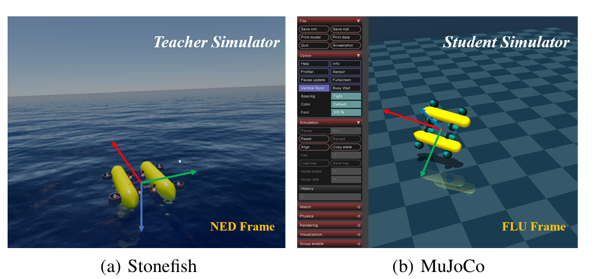
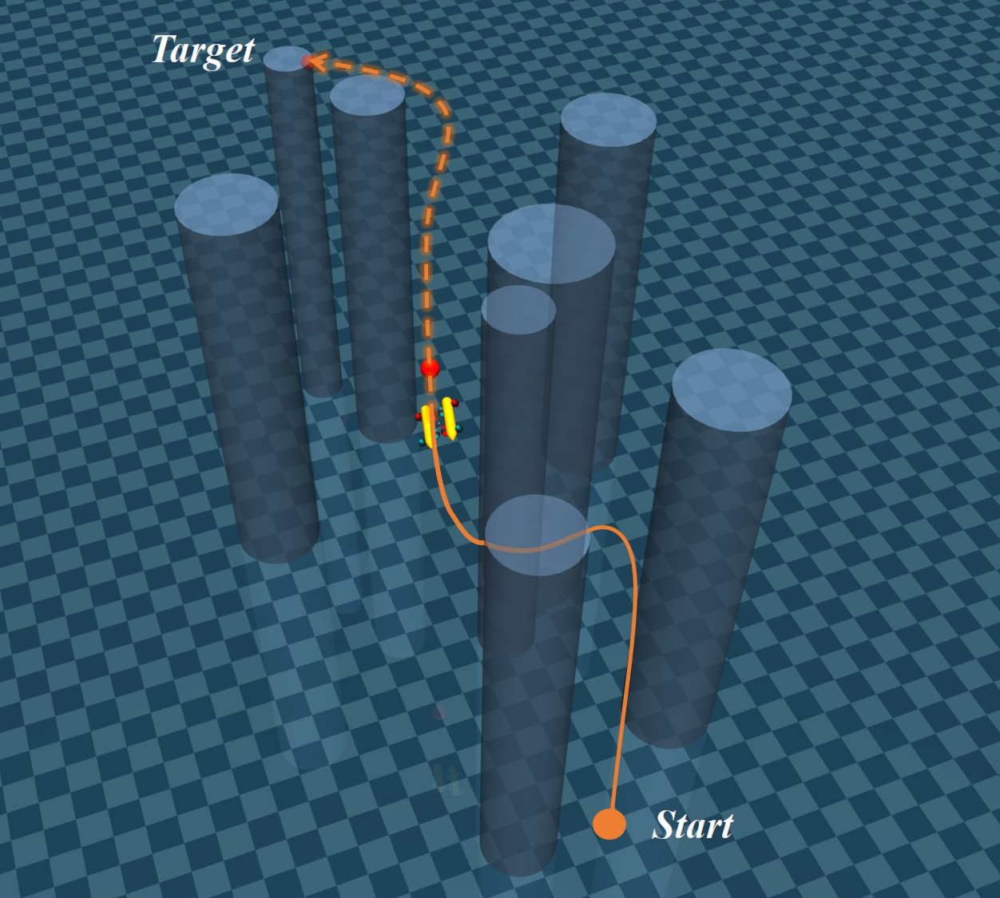

# AUV Deep RL Navigation — DeepHydroSim

A sim-to-real reinforcement learning framework for Autonomous Underwater Vehicle (AUV) navigation that bridges high-fidelity hydrodynamic simulation with scalable RL training.

**Core idea:** Stonefish provides physically accurate 6-DOF hydrodynamic data for a GIRONA500 AUV. An MLP (`DeepHydroMLP`) learns the nonlinear fluid dynamics from that data. The trained MLP is embedded as a custom plugin inside MuJoCo, enabling fast, differentiable RL training while retaining realistic hydrodynamics — without paying the runtime cost of a full CFD simulator.

<p align="center">
  
</p>
<p align="center"><sub>(a) <b>Teacher</b> — Stonefish (NED frame): high-fidelity data collection &nbsp;|&nbsp; (b) <b>Student</b> — MuJoCo (ENU frame): scalable RL training with learned hydrodynamics</sub></p>

---

## Architecture Overview

```
┌─────────────────────┐      CSV logs       ┌─────────────────────┐
│   Stonefish C++     │ ─────────────────▶  │    hydro_MLP        │
│   (cpp_sim/)        │                     │  (train DeepHydro   │
│  GIRONA500 AUV      │                     │   MLP from data)    │
│  8-thruster layout  │                     └──────────┬──────────┘
│  HybridDataCollect  │                                │  .pth weights
└─────────────────────┘                                ▼
                                            ┌─────────────────────┐
                                            │    mujoco_sim       │
                                            │  HydroInference     │
                                            │  plugin (ENU↔NED)   │
                                            │  SAC · curriculum   │
                                            │  A* path planning   │
                                            └─────────────────────┘
```

---

## Repository Structure

```
AUV_DRL_Navigation/
├── cpp_sim/                        # Stonefish data-collection application
│   └── src/
│       ├── MyAUVManager.{h,cpp}    # Simulation manager: robot, scene, data loop
│       ├── MyAUVApp.{h,cpp}        # OpenGL GUI / HUD overlay
│       ├── controllers/
│       │   ├── MotionController.h  # 6-DOF → 8-thruster mixing
│       │   └── MotionStrategy.h    # PID, MaxThrust, HybridDataCollection, OU noise
│       └── utils/
│           ├── DataCollector.h     # CSV logger (AUVState + 8 motor setpoints)
│           └── analysing_damping.py# Post-process: identify drag coefficients
│
├── hydro_MLP/                      # MLP training pipeline
│   ├── config.yaml                 # Training hyperparameters
│   └── src/
│       ├── model.py                # DeepHydroMLP  12→128→256→128→6
│       ├── dataset.py              # HydroDataset with train/val split
│       ├── data_process.py         # Inverse-dynamics feature extraction
│       ├── data_analysis.py        # Data quality / distribution analysis
│       ├── train.py                # Training entry point
│       ├── evaluate.py             # Aggregate evaluation metrics
│       └── evaluate_detail.py      # Per-DOF and per-sample analysis
│
├── mujoco_sim/                     # MuJoCo RL training environment
│   ├── configs/
│   │   ├── config.yaml             # SAC hyperparameters, Hydra defaults
│   │   ├── env/default.yaml        # Environment parameters
│   │   └── task/
│   │       ├── stage1_navigate.yaml
│   │       ├── stage2_avoidance.yaml
│   │       └── stage3_domain_navigation.yaml
│   ├── scripts/
│   │   ├── train.py                # SAC training with curriculum & WandB
│   │   ├── evaluate.py             # MuJoCo passive-viewer evaluation
│   │   ├── enjoy_rl.py             # Interactive rollout viewer
│   │   └── check_env.py            # Sanity-check the Gym environment
│   └── src/
│       ├── core/
│       │   ├── hydro_plugin.py     # HydroInference: MLP inference inside MuJoCo step
│       │   ├── robot.py            # AUVRobot: kinematics, thruster mixing
│       │   ├── sensors.py          # IMU, DVL sensor wrappers
│       │   └── scene_builder.py    # MuJoCo XML scene construction
│       ├── envs/
│       │   ├── auv_base_env.py     # Gymnasium base environment
│       │   └── tasks/
│       │       ├── navigation_task.py          # Stage 1: point-to-point
│       │       ├── avoidance_task.py           # Stage 2: obstacle avoidance
│       │       └── domain_navigation_task.py   # Stage 3: A* + arc-length progress
│       └── utils/
│           ├── kalman_filter.py    # KalmanFilter6D for acceleration estimation
│           ├── astar_planner.py    # A* on occupancy grid → arc-length trajectory
│           ├── logger.py           # WandB + TensorBoard integration
│           ├── check_mlp.py        # Verify MLP predictions against logged data
│           ├── verify_sensors.py   # Unit tests for sensor wrappers
│           └── verify_imu.py       # IMU rotation matrix consistency checks
│
├── requirements.txt
└── README.md
```

---

## Prerequisites

| Component | Requirement |
|-----------|-------------|
| Python | ≥ 3.10 |
| PyTorch | ≥ 2.1 (CUDA recommended) |
| MuJoCo | ≥ 3.1 |
| Stonefish | Built from source — see [Stonefish docs](https://stonefish.readthedocs.io) |
| C++ compiler | GCC ≥ 11 or Clang ≥ 14, CMake ≥ 3.16 |

---

## Installation

```bash
git clone https://github.com/HoshinoRay/AUV_DRL_Navigation.git
cd AUV_DRL_Navigation
pip install -r requirements.txt
```

Build the Stonefish data-collection application:

```bash
cd cpp_sim
mkdir build && cd build
cmake .. -DCMAKE_BUILD_TYPE=Release
make -j$(nproc)
```

---

## Workflow

### Step 1 — Collect hydrodynamic data (Stonefish)

Run the compiled application. The `HybridDataCollectionStrategy` automatically executes deterministic per-DOF sinusoidal manoeuvres (surge, heave, roll, pitch, yaw, and coupled tests) followed by stochastic Ornstein-Uhlenbeck exploration:

```bash
./cpp_sim/build/MyAUVApp
```

Logs are written to `cpp_sim/logs/GeneralMission_<timestamp>.csv`.  
Inspect drag coefficients from the collected data:

```bash
python cpp_sim/src/utils/analysing_damping.py          # auto-selects latest log
python cpp_sim/src/utils/analysing_damping.py path/to/log.csv
```

---

### Step 2 — Train the hydrodynamic MLP

```bash
cd hydro_MLP
python src/data_process.py        # inverse-dynamics feature extraction
python src/train.py               # trains DeepHydroMLP (12 → 128 → 256 → 128 → 6)
python src/evaluate.py            # aggregate metrics
python src/evaluate_detail.py     # per-DOF analysis
```

Trained weights and scalers are saved to `hydro_MLP/models/`.

**DeepHydroMLP architecture:**
```
Input  (12):  [u, v, w, p, q, r, u̇, v̇, ẇ, ṗ, q̇, ṙ]  — velocity + acceleration in NED
Output  (6):  [Fx, Fy, Fz, Mx, My, Mz]                 — hydrodynamic wrench
```

**Inverse dynamics used for label generation:**
```
F_fluid = τ_prop − M_total · a̅
```
where `M_total` is the rigid-body + added-mass diagonal and `a̅` is smoothed via Savitzky-Golay + finite difference.

**Prediction accuracy — density plots (predicted vs. ground truth):**


*Tight diagonal across Surge, Heave, Roll and Pitch forces confirms the MLP generalises well over the full force/torque range.*

**Prediction quality across velocity regimes:**


*Representative time-windows at low, medium and high velocity. Black = ground truth, blue/pink = MLP prediction. Model tracks well in medium and high regimes; low-velocity noise is inherent to the inverse-dynamics labels.*

---

### Step 3 — Train the RL agent (MuJoCo)

Place trained MLP weights into `mujoco_sim/src/weights/`.  
Edit `mujoco_sim/configs/config.yaml` to point `weights_dir` at your model.

```bash
cd mujoco_sim
python scripts/train.py                         # stage 1 navigation (default)
python scripts/train.py task=stage2_avoidance   # stage 2 obstacle avoidance
python scripts/train.py task=stage3_domain_navigation  # stage 3 A*-guided navigation
```

The training loop uses **SAC** (Stable Baselines3) with:
- `VecNormalize` for observation and reward normalisation
- Curriculum advancement on rolling success-rate threshold
- WandB + TensorBoard logging
- Automatic checkpoint saving every `save_freq` steps

---

### Step 4 — Evaluate

```bash
cd mujoco_sim
python scripts/evaluate.py          # passive MuJoCo viewer
python scripts/enjoy_rl.py          # interactive rollout with episode statistics
```

---

## Configuration

All hyperparameters are managed with **Hydra** (`omegaconf`). Key settings in `mujoco_sim/configs/config.yaml`:

| Parameter | Default | Description |
|-----------|---------|-------------|
| `total_timesteps` | 5 000 000 | Total SAC training steps |
| `num_envs` | 1 | Parallel environments |
| `batch_size` | 512 | SAC mini-batch size |
| `learning_rate` | 3e-4 | Adam learning rate |
| `eval_freq` | 10 000 | Steps between evaluations |
| `gradient_steps` | `${num_envs}` | UTD ratio kept at 1:1 |

Override any parameter on the command line:
```bash
python scripts/train.py total_timesteps=10000000 hyperparams.batch_size=256
```

---

## Curriculum Stages

| Stage | Task | Key challenge |
|-------|------|---------------|
| 1 — `navigate` | Point-to-point (fixed start/goal) | Stable 6-DOF control |
| 2 — `avoidance` | Navigate with static obstacles | Collision penalty shaping |
| 3 — `domain_navigation` | A*-guided path in cluttered domain | Arc-length progress reward + PBRS |

Stage 3 uses an arc-length coordinate system along the A* waypoint path, giving a monotonically increasing progress signal that avoids local reward plateaus.

<p align="center">
  
</p>
<p align="center"><sub>Stage 3 — GIRONA500 navigating a cluttered domain. Orange solid line: executed trajectory. Orange dashed line: A* reference path.</sub></p>

**RL training results — 5 seeds, shading = ±1 std:**

<table>
  <tr>
    <td width="50%">
      
      <p align="center"><sub>Mean evaluation reward</sub></p>
    </td>
    <td width="50%">
      
      <p align="center"><sub>Evaluation success rate</sub></p>
    </td>
  </tr>
</table>

| Condition | Description |
|-----------|-------------|
| **R₀** (red) | Rigid-body baseline — MLP zeroed (`simplified_mode`) |
| **R_MLP** (green) | Full hydrodynamic MLP plugin |
| **R_PhysFeat** (blue) | Physics-feature augmented observation |

---

## Coordinate Frames

The MLP is trained on Stonefish data logged in **NED** (North-East-Down).  
MuJoCo uses **ENU** (East-North-Up).  
The `HydroInference` plugin applies a sign-flip mask before inference and after output:

```python
COORD_MASK = [+1, -1, -1, +1, -1, -1]   # [Surge, Sway, Heave, Roll, Pitch, Yaw]
```

---

## Ablation: Simplified Mode

`HydroInference.predict()` accepts a `gain` parameter. Setting `gain=0.0` in the config zeros the MLP output while keeping all other dynamics intact, producing a **pure rigid-body baseline** for ablation experiments. This is controlled by the `simplified_mode` flag in `mujoco_sim/configs/env/default.yaml`.

---

## Dependencies

```
numpy, pandas, scipy, scikit-learn, matplotlib   # scientific stack
torch                                             # DeepHydroMLP
mujoco, stable-baselines3, gymnasium             # RL environment
hydra-core, omegaconf, wandb                     # experiment management
joblib                                            # scaler serialisation
```

Install all at once: `pip install -r requirements.txt`

---

## Citation

If you use this work, please cite:

```bibtex
@misc{deephyrosim2025,
  author  = {Ray Wu},
  title   = {AUV Deep RL Navigation — DeepHydroSim},
  year    = {2025},
  url     = {https://github.com/HoshinoRay/AUV_DRL_Navigation}
}
```

---

## Acknowledgements

- [Stonefish](https://github.com/patrykcieslak/stonefish) — high-fidelity underwater simulator
- [MuJoCo](https://mujoco.org) — physics engine for RL training
- [Stable Baselines3](https://github.com/DLR-RM/stable-baselines3) — SAC implementation
- GIRONA500 AUV from the University of Girona
